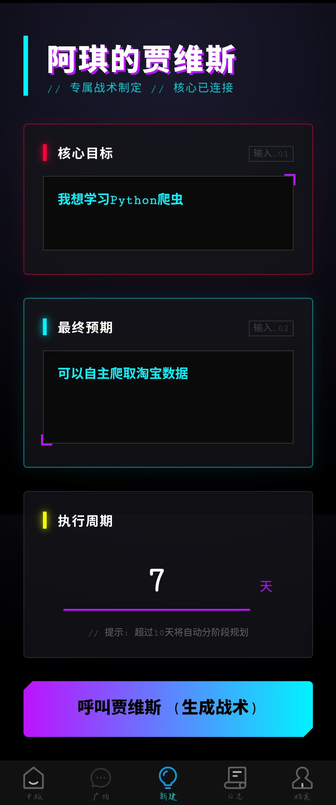
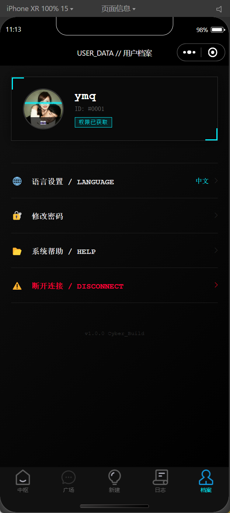
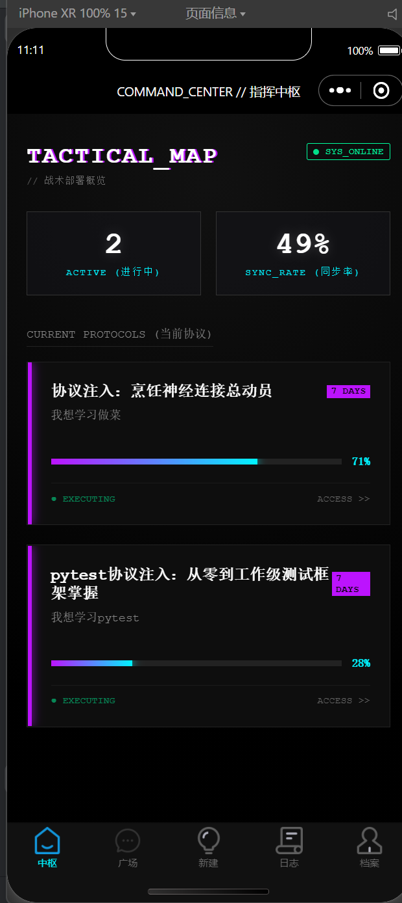
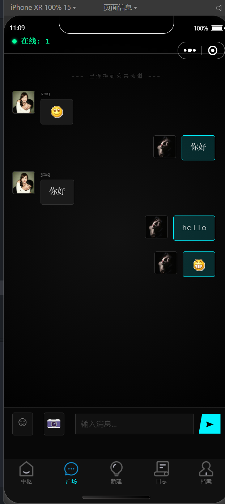

---

# ⚡ TaskLink | 赛博朋克·智能战术终端


> **"连接现实与数字边界，阿琪的专属贾维斯战术终端。"**

**TaskLink** 是一款集成了 **AI 战术规划** 与 **实时社交** 的全栈应用。它不仅仅是一个任务清单，更是一个拥有极致 **Cyberpunk Visuals** (赛博朋克视觉) 的个人数字指挥中心。

通过 DeepSeek 大模型的加持，它能将你的模糊目标转化为精确的执行路径；同时支持多人在线的实时即时通讯功能。

---

## 🌌 核心特性 (Core Features)

### 🧠 1. 神经战术规划 (Neural Planner)

* **DeepSeek 驱动**：内置“阿琪的贾维斯”AI 人设，接入 DeepSeek API。
* **智能分段**：自动识别长短期目标。对于超过 10 天的计划，自动拆解为“战术阶段 (Phases)”而非流水账。
* **动态终端**：生成计划时模拟黑客终端的思考日志（握手、解构、注入算法），提供沉浸式等待体验。
* **打字机特效**：计划详情支持 Markdown 渲染与流式打字机回显。

### 💬 2. 网络广场 (Net Square)

* **双塔架构**：业务逻辑由 Python Flask 处理，实时通讯由 **Node.js + Socket.IO** 独立承载。
* **高并发聊天**：支持多人在线即时通讯，消息毫秒级同步。
* **无感鉴权**：Node.js 服务复用 Flask 的用户认证状态。

### 🎨 3. 赛博视觉 (Cyberpunk UI)

* **暗黑霓虹**：全局黑底 + 霓虹蓝/紫/红配色。
* **故障艺术**：Glitch 字体效果、扫描线动画、呼吸灯效。
* **响应式布局**：完美适配不同尺寸的手机屏幕，Flex 弹性布局。

## 📸 项目截图 (Screenshots)

> *注：以下界面展示了极致的赛博朋克风格与核心功能。请确保在 `docs/images/` 目录下放入对应的截图文件。*

| 🧠 战术规划终端 (AI Planner) |             📊 个人主页 (Profile)             |
| :---: |:-----------------------------------------:|
|  |  |
| *▲ 接入 DeepSeek 的沉浸式生成界面* |              *▲ 赛博朋克风格的个人主页*              |

| 📅 战术执行详情 (Execution) | 💬 网络广场 (Net Square) |
| :---: | :---: |
|  |  |
| *▲ 支持打字机特效的节点详情* | *▲ 高并发实时通讯终端* |


## 🏗️ 系统架构 (Architecture)

本项目采用前后端分离架构，分为三个独立模块：

```text
TaskLink/
├── TaskLink_backend/      # 🐍 [Python Flask] 核心中枢
│   ├── app.py             # API 入口 & 业务逻辑 & AI 接口
│   ├── models.py          # SQLAlchemy 数据库模型
│   ├── database.py        # 数据库连接
│   └── requirements.txt   # 后端依赖列表
│
├── TaskLink_chat/         # 🟢 [Node.js] 实时信令塔
│   ├── index.js           # Socket.IO 服务端
│   └── package.json       # 依赖配置
│
├── TaskLink_uniapp/       # 📱 [Vue3 UniApp] 战术前端
│   ├── pages/             # 页面 (Add, Index, Detail, Square...)
│   ├── static/            # 静态资源
│   └── uni.scss           # 全局赛博样式
│
└── .env                   # 🔐 环境变量 (配置 API Key)

```

---

## 🚀 快速启动与部署 (Quick Start)

### 1. 环境准备 (Prerequisites)

请确保您的开发环境已安装以下工具：

* **Python** 3.9+
* **Node.js** 16+
* **MySQL** 8.0+
* **HBuilderX** (用于运行 UniApp 前端)

### 2. 启动后端服务 (Python Flask)

后端负责处理用户数据、AI 对话及数据库交互。

```bash
# 1. 进入后端目录
cd TaskLink_backend

# 2. 安装依赖
# 建议使用虚拟环境 (venv)
pip install -r requirements.txt

# 3. 配置环境变量
# 在项目根目录(即 TaskLink_backend 的上一级) 创建 .env 文件
# 内容如下：
# DEEPSEEK_API_KEY=sk-你的DeepSeek密钥

# 4. 启动服务
python app.py
# 服务将运行在: http://0.0.0.0:5000

```

### 3. 启动聊天服务 (Node.js)

独立的实时通讯服务，负责广场聊天功能。

```bash
# 1. 进入聊天服务目录
cd TaskLink_chat

# 2. 安装依赖
npm install

# 3. 启动服务
node index.js
# 服务将运行在: http://0.0.0.0:3000

```

### 4. 运行前端 (UniApp)

1. 下载并安装 **HBuilderX**。
2. 点击 `文件` -> `导入` -> `从本地目录导入`，选择 `TaskLink_uniapp` 文件夹。
3. 找到 `common/config.js` 或请求封装文件（如有），确保 API 地址指向你的本机 IP（例如 `http://127.0.0.1:5000` 或局域网 IP）。
4. 点击顶部菜单 `运行` -> `运行到浏览器` 或 `运行到手机模拟器`。

---

## 🛠️ 技术栈细节 (Tech Stack)

* **Frontend**: Vue3 (Composition API), UniApp, SCSS (Cyberpunk Theme)
* **Backend**: Flask, SQLAlchemy, PyMySQL
* **Realtime**: Socket.IO, Express
* **AI**: DeepSeek V3 API (Reasoning Mode)

---

## 📄 License

This project is licensed under the MIT License.

---

> **TaskLink** - *Wake up, Samurai. We have a city to burn.*